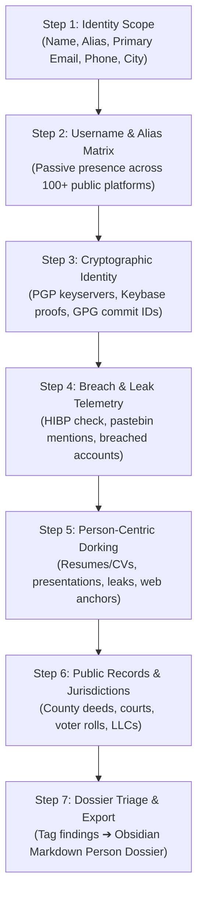

# 👤 Visage - Project Handover & Context Document

> **Personal Identity Intelligence, Executive Exposure & People OSINT Workstation**  
> *A sister extension and tactical companion to [Vantage](https://github.com/mrnickpeer/Vantage).*

---

## 🎯 Executive Summary & Mission

**Visage** is a browser-native reconnaissance and personal exposure audit suite designed for:
* **Security Analysts & Red Teams**: Spear-phishing simulation, social engineering pretexting, and target characterization.
* **Executive Protection & Blue Teams**: VIP privacy audits, assessing whether executives' personal emails, home addresses, phone numbers, or family details are exposed online.
* **OSINT Researchers & Journalists**: Investigating persons of interest across public records, identity proofs, and digital footprints without touching the target.

### 🤝 Companion Relationship with Vantage
* **Vantage**: Focuses on **Companies, Domains & Infrastructure** (DNS, CIDRs, CRT.SH, Shodan, SaaS).
* **Visage**: Focuses on **Individuals, Humans & Identities** (Names, Aliases, Emails, Breaches, PGP keys, Personal Dorks).
* **Cross-Pollination**: Vantage Step 4 (Email & Personnel Discovery) can provide a 1-click pivot: *"Inspect in Visage"*, passing the discovered name/email straight into Visage.

---

## 🧭 The 7-Step Identity Methodology (Functional Architecture)



### Step 1: Scope Target Identity
* **Inputs**: Target Name (`First Last`), Username/Alias (`@handle`), Known Email, Known Phone, Location/Employer.
* **Normalization**: Dissects name variations (e.g. `John Doe`, `jdoe`, `john.doe`, `j_doe99`).

### Step 2: Username & Alias Matrix (Passive Presence)
* **Mechanic**: Checks if a target username or handle exists across popular platforms (GitHub, Reddit, Keybase, Mastodon, X, HackerNews, GitLab, DockerHub, etc.).
* **Zero-Touch Constraint**: Query public APIs or passive status checks with zero authentication required.

### Step 3: Cryptographic Identity & Public Key Telemetry
* **Mechanic**: 
  - Ubuntu PGP Keyserver (`keyserver.ubuntu.com`): Discover all emails associated with a person's PGP key.
  - Keybase Public Proofs: Cross-verify connected identities (Twitter, GitHub, Bitcoin, PGP).
  - GitHub GPG Commit Signatures: Extract verified commit author emails.

### Step 4: Breach & Leak Telemetry
* **Mechanic**:
  - HaveIBeenPwned API (or free breach status query): Surface which public database leaks the email appeared in (e.g., LinkedIn 2012, Dropbox, Adobe, Canva).
  - Pastebin / Ghostbin telemetry lookups for credential pastes.

### Step 5: Person-Centric Dork Compiler
Curated intent categories for individuals to establish location and institutional anchors:
* 📄 **Curriculum Vitae & Resumes**: `filetype:pdf "First Last" ("curriculum vitae" | resume | "work experience")`
* ⚖️ **Public & Legal Records**: Court filings, marriage licenses, corporate officer registrations.
* 🎤 **Conferences & Presentations**: `filetype:pdf OR filetype:pptx "First Last" (speaker | conference | presentation)`
* 🔑 **Pastes & Dumps**: Search pastes for leaked passwords, usernames, or phone numbers.
* 🖼️ **Exif & Image Dorks**: Direct shortcuts to reverse-image search and photo metadata.

### Step 6: Public Records & Jurisdictional Intelligence
* **Multi-Tier Sovereign Ground Truth**: Dynamic resolution across 50 US States + DC + PR.
* **County / Parish**: Deed registers, tax assessors GIS, local civil dockets, Board of Elections voter lookups.
* **State / Federal**: Secretary of State LLC filings, statewide court registers, professional licenses, official voter registration portals, PACER/court dockets.

### Step 7: Dossier Triage & Obsidian Export
* **Audit Log**: Add findings, classify risk (`Exposed Phone`, `Leaked Credential`, `Unlinked Account`), triage status (`Under Review`, `Confirmed`, `False Positive`, `Fixed`).
* **Multi-Dialect Export**:
  - **Obsidian Person Dossier**: Formatted markdown note with Dataview metadata, tags, and callouts.
  - **Raw GFM / Notion**: Clean layout for corporate reporting.
  - **Copy to Clipboard**: Instant clipboard copy.

---

## 🏛️ Engineering & Architecture Lessons from Vantage

To ensure Visage passes Mozilla AMO and Chrome Web Store review on Day 1 without delays:

1. **Manifest V3 Core**:
   * Pure un-minified vanilla JavaScript, HTML, and CSS.
   * **Zero remote code** (no CDN `<script>` tags, no `eval()`, everything local).
2. **Mozilla AMO Compliance Checklist**:
   * In `manifest.json`, under `browser_specific_settings.gecko`:
     ```json
     "browser_specific_settings": {
       "gecko": {
         "id": "visage@local.dev",
         "strict_min_version": "142.0",
         "data_collection_permissions": {
           "required": ["none"]
         }
       }
     }
     ```
   * Strictly set `strict_min_version: "142.0"` to avoid Android/Desktop compatibility warnings.
3. **Permissions Philosophy**:
   * Only request minimal, explicitly justified permissions: `storage`, `tabs`, `downloads`, `contextMenus`.
   * Specific `host_permissions` for OSINT endpoints (no `<all_urls>`).
4. **Input Sanitization**:
   * Wrap all dynamic DOM insertions with `escapeHtml()` to ensure 0 security warnings.
5. **Automated Multi-Store Build Script**:
   * Reuse Vantage's `build.js` to create unpacked trees and zip archives for both Firefox (`dist/firefox/`) and Chrome (`dist/chrome/`).

---

## 🚀 How to Start Development in a New Session

When opening a new session in `Visage-dev`:
1. Point your assistant to this file: `PROJECT_CONTEXT.md`.
2. Instruction to use:  
   > *"We are building Visage, the sister People-OSINT extension to Vantage, following the specification in PROJECT_CONTEXT.md."*
