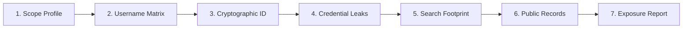

# 👤 Visage

> **Digital Footprint & Identity Privacy Audit Workstation**  
> *A zero-touch, browser-native identity exposure audit tool for privacy researchers, security analysts, and individuals.*  
> *Defensive companion extension to [Vantage](https://github.com/mrnickpeer/Vantage).*

---

## 🌟 Overview

**Visage** is an in-browser digital footprint and identity privacy audit workstation designed to evaluate public personal exposure, credential compromises, and privacy risks without active probing. While **Vantage** maps corporate domains, DNS zones, and infrastructure security, **Visage** audits digital footprints: account presence across 100+ platforms, public cryptographic keys, credential compromise telemetry, public search footprint queries, and structured exposure reports.

---

## 📸 Workstation Screenshots

### 1. 7-Step Digital Footprint Audit & 100+ Platform Username Matrix


### 2. Cryptographic Identity & Public Key Telemetry (OpenPGP & Keybase)


### 3. 50-State Public Records & Jurisdictional Directory Desk


---

## 🧭 The 7-Step Identity Privacy Audit Methodology

Visage guides analysts through an end-to-end, reproducible identity audit workflow:



1. **Scope Identity Profile**: Dissect full legal name, known aliases, primary email, phone number, location, and employer. Visage automatically generates handle permutation variations (e.g. `first.last`, `flast`, `firstl`, `lastf`) and dynamically resolves jurisdiction down to county/parish and state.
2. **Username & Alias Matrix**: Passively probe public presence across 100+ platforms (Developer, Social, Messaging, Media, and Gaming) with zero authentication required.
3. **Cryptographic Signatures & Public Key Telemetry**: Query Ubuntu OpenPGP keyservers (`keyserver.ubuntu.com`, `pgp.surf.nl`), Keybase verified identity proofs, and GitHub commit signatures to link disparate personal and corporate emails.
4. **Credential Exposure & Leak Telemetry**: Passive audit of public breach exposure, infostealer malware telemetry (Hudson Rock Cavalier), leaked paste shortlinks, and private in-browser **k-Anonymity** password hash range checking.
5. **Public Footprint Query Compiler**: Curated search queries for resumes/CVs, court records, corporate filings, conference presentations, and exposed documents with multi-engine support (Google with strict verbatim `&tbs=li:1`, Bing, DuckDuckGo, Brave, Yandex).
6. **Public Records & Jurisdictional Directory**: Multi-tier ground-truth sovereign records across all 50 US states, DC, and PR. Dynamic resolution of County/Parish property deeds, tax assessment GIS portals, board of elections voter rolls, official state voter status lookups, unified court case registers, state corporate/LLC filings, and professional licensing boards.
7. **Exposure Report Triage & Export**: Classify findings by risk severity, triage status, and remediation notes. Export directly to Markdown reports (with Dataview metadata and callouts), CSV, or JSON. Restore previous audits with 1-click import of any Visage JSON or Markdown report.

---

## 🔒 Architecture, OPSEC & Rate-Limit Shields

- **100% Client-Side**: Visage runs entirely within your browser. No target names, emails, queries, or dossier notes are ever transmitted to external servers.
- **Zero Remote Scripts**: Built strictly with vanilla HTML5, CSS, and modern JavaScript. Contains no CDN dependencies, no `eval()`, and no remote code in compliance with Mozilla AMO and Chrome Web Store policies.
- **Private k-Anonymity Range Queries**: Passwords tested in the breach panel are hashed locally via Web Cryptography `crypto.subtle.digest("SHA-1")` — only a 5-character prefix is queried over the wire.
- **Rate-Limit & Anti-Bot Shields**: Includes client-side debouncing, Nominatim 1.1s interval guards, staggered tab opening delays (350–450ms) to prevent search engine CAPTCHAs, and transparent diagnostic banners if public unauthenticated API limits are reached (e.g., GitHub 60 req/hr).
- **Local Storage Isolation**: All audit logs, custom profiles, and findings remain strictly stored on your device via `browser.storage.local`.
- **Privacy Policy**: Read our comprehensive zero-telemetry disclosure in [PRIVACY.md](PRIVACY.md).

---

## 🛠️ Installation & Development

### Prerequisites
- Node.js (v18+)

### Building Multi-Store Packages
```bash
# Validate JavaScript syntax
npm test

# Build verified unpacked trees and store submission zip archives
npm run build
```

The build process produces:
- `dist/visage-firefox-v1.0.3.zip` (Ready for Mozilla AMO submission)
- `dist/visage-chrome-v1.0.3.zip` (Ready for Chrome Web Store submission)
- `dist/firefox/` (Unpacked Firefox add-on directory)
- `dist/chrome/` (Unpacked Chrome extension directory)

### Loading in Firefox (Developer Mode)
1. Open Firefox and navigate to `about:debugging#/runtime/this-firefox`.
2. Click **"Load Temporary Add-on..."**.
3. Select `dist/firefox/manifest.json` (or root `manifest.json`).

### Loading in Google Chrome / Brave / Edge
1. Navigate to `chrome://extensions/`.
2. Enable **Developer mode** in the upper right.
3. Click **"Load unpacked"** and select the `dist/chrome/` directory.

---

## 🤝 Cross-Pollination with Vantage

Visage is built to work seamlessly with [Vantage](https://github.com/mrnickpeer/Vantage):
- **1-Click Pivot**: Visage natively accepts query parameters (`dashboard.html?name=John+Doe&email=jdoe@example.com&alias=jdoe`) allowing external discovery pipelines or Vantage Step 4 (Email & Personnel Discovery) to launch Visage with pre-scoped targets.
- **Reverse Pivot**: Use the *"Open Domain in Vantage"* companion button to extract the target's corporate domain and pivot directly back to infrastructure reconnaissance.

---

## 📄 License

MIT License
