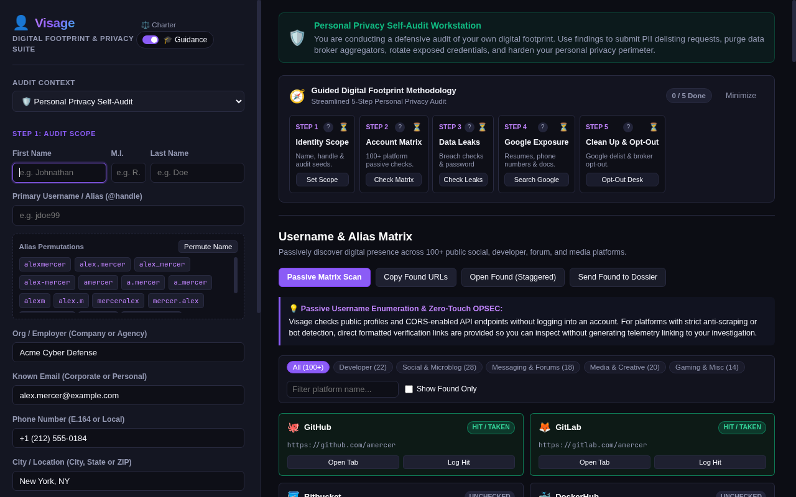
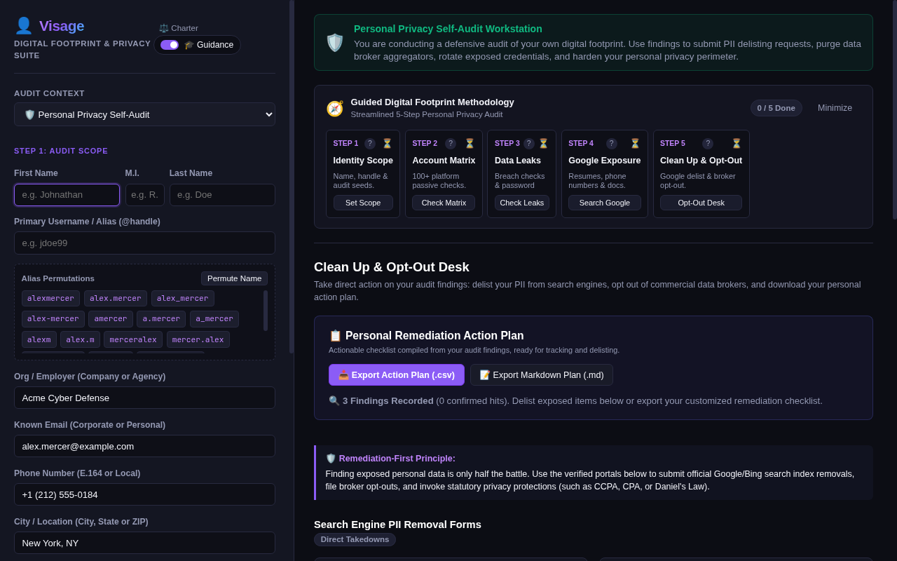
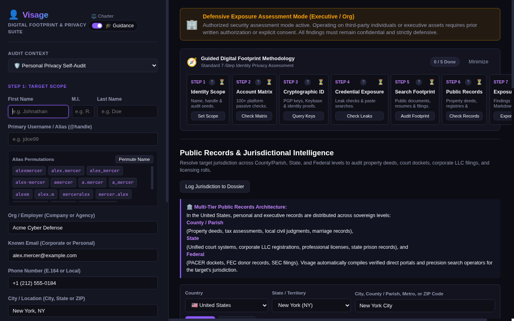
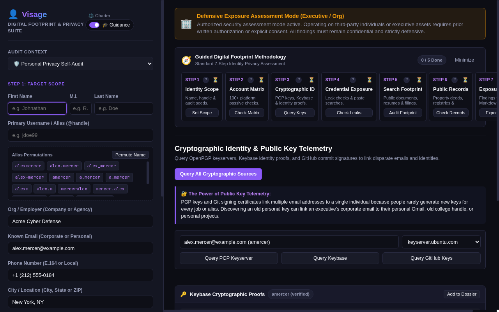
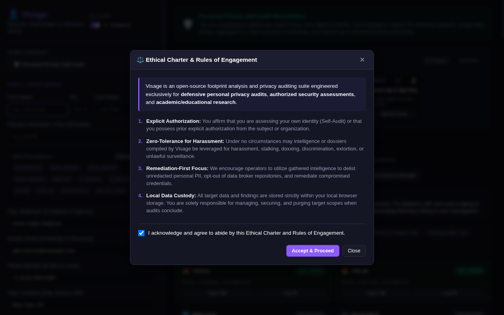
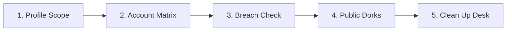
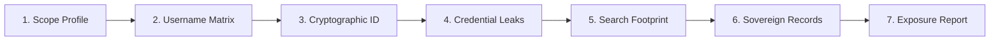

# 👤 Visage

> **Digital Footprint & Identity Privacy Audit Workstation**  
> *A zero-touch, browser-native identity exposure audit tool for privacy researchers, security analysts, and individuals.*  
> *Defensive companion extension to [Vantage](https://github.com/mrnickpeer/Vantage).*

---

## 🌟 Overview

**Visage** is an in-browser digital footprint and identity privacy audit workstation designed to evaluate public personal exposure, credential compromises, and privacy risks without active probing. While **Vantage** maps corporate domains, DNS zones, and infrastructure security, **Visage** audits digital footprints: account presence across 100+ platforms, public cryptographic keys, credential compromise telemetry, public search footprint queries, and structured exposure reports.

---

## 📸 Workstation Screenshots

### 1. Personal Privacy Self-Audit & 100+ Platform Username Matrix


### 2. Clean Up & Opt-Out Desk (Remediation Action Plan & Direct Delisting)


### 3. Defensive Assessment Mode & 50-State Sovereign Records Desk


### 4. Cryptographic Identity & Public Key Telemetry (OpenPGP & Keybase)


### 5. Ethical Operations Charter & Rules of Engagement


---

## 🧭 Dual-Mode Identity Audit Methodology

Visage provides two tailored operating contexts depending on your mission and authorization:

### 🛡️ 1. Personal Privacy Self-Audit Mode (Default)
Streamlined 5-step workflow built specifically for individuals and privacy advocates auditing their own digital footprint, identifying exposed personal data, and executing direct takedowns:



1. **Profile Scope**: Input your name, aliases, email, phone, and home jurisdiction. Generates handle permutations and maps jurisdiction down to county and state.
2. **Account Matrix**: Check public profile presence across 100+ platforms (Developer, Social, Messaging, Media, and Gaming) with zero authentication.
3. **Breach Check**: Passive credential compromise evaluation and in-browser **k-Anonymity** password hash check.
4. **Public Dorks**: Search engine queries to identify exposed contact information, personal documents, and index leaks.
5. **Clean Up & Opt-Out Desk**: Actionable remediation hub featuring official search engine PII removal forms (Google & Bing), direct opt-out portals for major data brokers (Whitepages, BeenVerified, Radaris, Spokeo, FastPeopleSearch, LexisNexis), and 1-click local audit data purge.

---

### ⚖️ 2. Defensive Exposure Assessment Mode (Authorized Blue-Team)
Comprehensive 7-step workflow with an amber warning banner for authorized security analysts and corporate blue teams assessing personnel threat surfaces with explicit organizational consent:



1. **Scope Identity Profile**: Dissect full legal name, known aliases, primary email, phone number, location, and employer. Generates permutations and resolves local jurisdiction.
2. **Username & Alias Matrix**: Passively evaluate handle presence across 100+ developer, social, and messaging ecosystems.
3. **Cryptographic Signatures & Public Key Telemetry**: Query Ubuntu OpenPGP keyservers (`keyserver.ubuntu.com`, `pgp.surf.nl`), Keybase verified proofs, and GitHub commit signatures to link corporate and personal identities.
4. **Credential Exposure & Leak Telemetry**: Passive audit of public breach exposure, infostealer malware telemetry, leaked paste shortlinks, and private k-Anonymity password checks.
5. **Public Footprint Query Compiler**: Curated search queries for resumes, court records, corporate filings, conference presentations, and exposed documents across Google (verbatim), Bing, DuckDuckGo, Brave, and Yandex.
6. **Sovereign Public Records & Jurisdictional Directory**: Official ground-truth sovereign portals across all 50 US states, DC, and PR: County/Parish property deeds (GIS), state voter registration status, unified state court registers, corporate/LLC entity filings, and professional licensing boards.
7. **Exposure Report Triage & Export**: Classify findings by severity, triage status, and remediation notes. Export to Markdown dossiers (with Dataview metadata), CSV, or JSON.

---

## 🔒 Architecture, OPSEC & Ethical Guardrails

- **100% Client-Side**: Visage runs entirely within your browser. No target names, emails, queries, or dossier notes are ever transmitted to external servers.
- **Zero Remote Scripts**: Built strictly with vanilla HTML5, CSS, and modern JavaScript. Contains no CDN dependencies, no `eval()`, and no remote code in compliance with Mozilla AMO, Chrome Web Store, and Edge Add-ons policies.
- **Ethical Charter & Affirmation**: Enforces a first-run Rules of Engagement charter and explicit consent modal before accessing defensive multi-source discovery.
- **Private k-Anonymity Range Queries**: Passwords tested in the breach panel are hashed locally via Web Cryptography `crypto.subtle.digest("SHA-1")` — only a 5-character prefix is queried over the wire.
- **Rate-Limit & Anti-Bot Shields**: Includes client-side debouncing, Nominatim 1.1s interval guards, staggered tab opening delays (350–450ms) to prevent search engine CAPTCHAs, and transparent diagnostic banners.
- **Local Storage Isolation & Instant Purge**: All audit logs and profiles remain on your device via `browser.storage.local`, with an instant 1-click purge button in the Clean Up Desk.
- **Privacy Policy**: Read our comprehensive zero-telemetry disclosure in [PRIVACY.md](PRIVACY.md).

---

## 🛠️ Installation & Development

### Prerequisites
- Node.js (v18+)

### Building Multi-Store Packages
```bash
# Validate JavaScript syntax
npm test

# Build verified unpacked trees and store submission zip archives
npm run build
```

The build process produces:
- `dist/visage-firefox-v1.1.0.zip` (Ready for Mozilla AMO submission)
- `dist/visage-chrome-v1.1.0.zip` (Ready for Chrome Web Store & Edge Add-ons submission)
- `dist/firefox/` (Unpacked Firefox add-on directory)
- `dist/chrome/` (Unpacked Chrome extension directory)

### Loading in Firefox (Developer Mode)
1. Open Firefox and navigate to `about:debugging#/runtime/this-firefox`.
2. Click **"Load Temporary Add-on..."**.
3. Select `dist/firefox/manifest.json` (or root `manifest.json`).

### Loading in Google Chrome / Brave / Edge
1. Navigate to `chrome://extensions/`.
2. Enable **Developer mode** in the upper right.
3. Click **"Load unpacked"** and select the `dist/chrome/` directory.

---

## 🤝 Cross-Pollination with Vantage

Visage is built to work seamlessly with [Vantage](https://github.com/mrnickpeer/Vantage):
- **1-Click Pivot**: Visage natively accepts query parameters (`dashboard.html?name=John+Doe&email=jdoe@example.com&alias=jdoe`) allowing external discovery pipelines or Vantage Step 4 (Email & Personnel Discovery) to launch Visage with pre-scoped targets.
- **Reverse Pivot**: Use the *"Open Domain in Vantage"* companion button to extract the target's corporate domain and pivot directly back to infrastructure reconnaissance.

---

## 📄 License

MIT License

